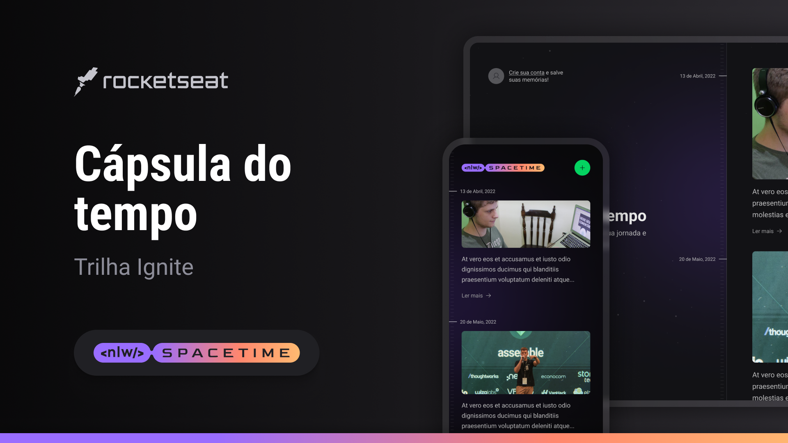

  

## 🖥️ Projeto
Esse é um projeto  web responsivo de cápsula do tempo para exibir memórias em uma timeline.

## 🚀 Tencologias
Esse projeto foi desenvolvido durante o NLW da Rocketseat com as seguintes tecnologias:

- HTML
- CSS
- Git e Github

## 🏷️ Layout
Você pode visualizar o layout do projeto através [desse link](https://www.figma.com/file/vIBEHoHnwVekStEKb3FZyU/C%C3%A1psula-do-tempo-%E2%80%A2-Trilha-Ignite-(Community)-(Copy)?type=design&node-id=205%3A3&t=7oGci8VGAo7tM6To-1).
É necessário ter uma conta no [Figma](https://www.figma.com)